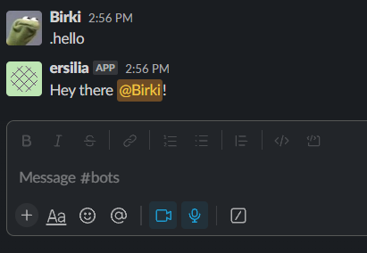

# slack 💬

A slash command Slack bot for Ersilia

## Usage

⚠️ THIS IS AN EXPERIMENTAL PROJECT ⚠️



## Development

This section goes over how to get started with development for this Slack application.

### Requirements

To get started with development, you will need the following:

- [pipenv](https://pipenv.readthedocs.io/en/latest/)
- [python3.11](https://www.python.org/downloads/release/python-3110/)

You will need to create a `.env` file in the root of the project with the following:

- `SLACK_BOT_TOKEN` - The token for the Slack bot
- `SLACK_APP_TOKEN` - The token for the Slack app

You can find details on creating these tokens [here](https://slack.dev/bolt-python/tutorial/getting-started).

### Starting the App Locally

Run the following commands to spin up a development environment:

```bash
pipenv install
```

> This will install all the dependencies for the project

```bash
pipenv run dev
```

> This will spin up a development server on port 8000
